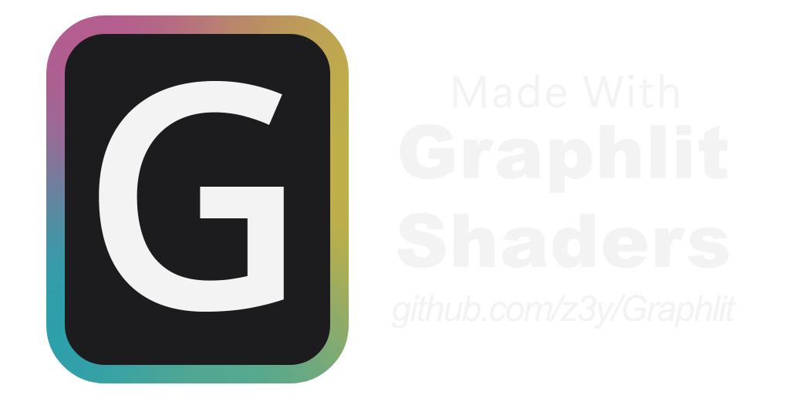

  
  
A node shader editor for Toon and PBR shaders 
  Supports the Built-In and Universal Render Pipeline

## [Discord](https://discord.gg/bw46tKgRFT)

## Setup

- Install with the [VRChat Creator Companion](https://z3y.github.io/vpm-package-listing/) or add the git url
- To get started read the [Documentation](https://z3y.github.io/Graphlit)
- You can try out the shader in the [VRChat World](https://vrchat.com/home/world/wrld_6fd2e6c4-d4f2-49ea-8cf6-ce7ccb0e7111)
- Setup the project [config file](https://z3y.github.io/Graphlit/config)
- Use one of the included shaders, or create your own `Assets/Create/Graphlit/Lit Graph` (double click to open in the node editor)

## Support

- If you like this project consider supporting on [Patreon](https://www.patreon.com/z3y)
- Alternatively you can use the included `Packages/Graphlit/Runtime/Graphlit Attribution` prefab in your world

## Included Shaders

- Main PBR shader created with the graph included (Recommended): `Graphlit/Lit`
- PBR shader with standard input: `Graphlit/Standard Compatible`

## Highlighted Features

### PBR Features

- Based on CoreRP, Google Filament, OpenPBR
- [Bakery](https://assetstore.unity.com/packages/tools/level-design/bakery-gpu-lightmapper-122218) Features (MonoSH, Lightmapped Specular, Bicubic Lightmap)
- [LTCGI](https://github.com/PiMaker/ltcgi), [AreaLit](https://booth.pm/ja/items/3661829)
- [Clustered BIRP](https://github.com/z3y/ClusteredBIRP)
- [VRC Light Volumes](https://github.com/REDSIM/VRCLightVolumes)
- PCF shadow filtering for point and spot lights
- Inverse square falloff
- Specular Occlusion
- Contact Hardening
- Horizon Occlusion
- Alpha To Coverage
- Energy Conservation
- Multi Bounce AO
- Micro Shadowing
- F82 metallic edge tint
- Coat
- Thin Film iridescence
- Improved [Box Projection](https://z3y.github.io/Graphlit/udonrp)

### Shader Editor

- Create PBR or Toon shaders
- Full custom lighting with the Unlit graph with access to the Light Color, Direction, Shadow Attenuation and Distance Attenuation
- Outlines
- Highest quality node previews
- Register/Fetch variable nodes
- Live Preview
- Varyings Packing
- Keyword properties pass flags option
  - Reduces shader variants, code, varings and attributes for the true branch
- [Hotkeys](https://z3y.github.io/Graphlit/hotkeys)

### Universal Render Pipeline

Currently not implemented:

- Forward+
- Dots
- Decals
- Rendering Layers
- SSAO

## Screenshots

### Example Materials

### Graph

### Main Shader

### Softer light shadows

### Live Preview

- Convert all constant nodes to properties while creating the shader to preview directly in the scene. This only affects the imported material

https://github.com/user-attachments/assets/eb1c1830-54ef-4cad-aa5b-961fc721ded8

https://github.com/z3y/MyShaderGraph/assets/33181641/ae523917-56ee-420d-90ac-a3f3afdecf82
